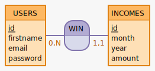

# Gestion des données

## Modèle Conceptuel de Données  

## Dictionnaire de données  

&nbsp;

### Table name : Users  

| Name | Type | Specificity | Description  |
|-|-|-|-|
| id | INT | PRIMARY KEY, NOT NULL, UNSIGNED, AUTO_INCREMENT | ID of the user|  
| firstname | VARCHAR | NOT NULL | firstname of the user |
| email | VARCHAR | NOT NULL, UNIQUE | email of the user |
| password | VARCHAR | NOT NULL | password of the user |

&nbsp;

**PRIMARY KEY** : id

&nbsp;

### Table name : Incomes  

| Name | Type | Specificity | Description |
|-|-|-|-|
| id | INT | PRIMARY KEY, NOT NULL, UNSIGNED, AUTO_INCREMENT | ID of the income|
| user_id | BIGINT | FOREIGN KEY, NOT NULL, UNSIGNED | ID of the user |
| month | VARCHAR | NOT NULL, INDEX | month of the income |
| year | BIGINT | NOT NULL, UNSIGNED, INDEX | year of the income |
| amount | BIGINT | UNSIGNED | amount of the income  |

&nbsp;

**PRIMARY KEY** : id  
**FOREIGN KEY** : user_id REFERENCES users (id)
